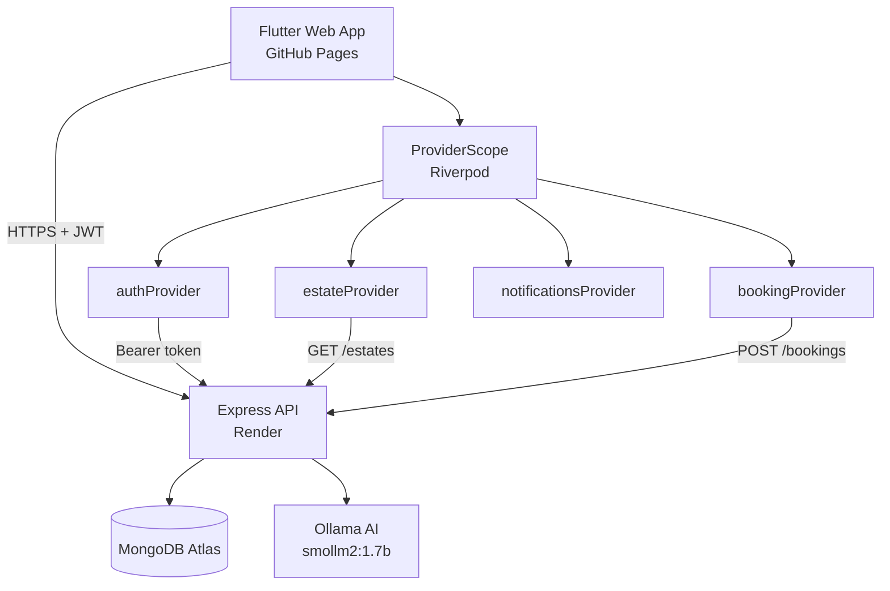
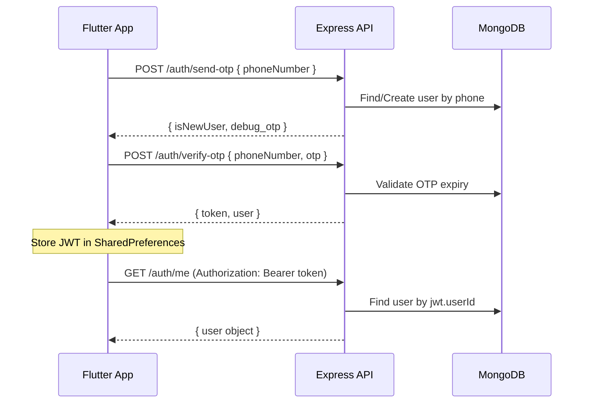
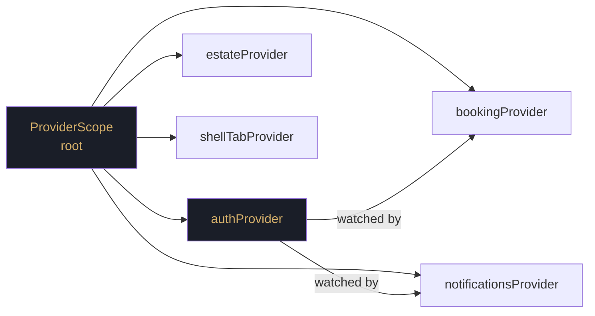
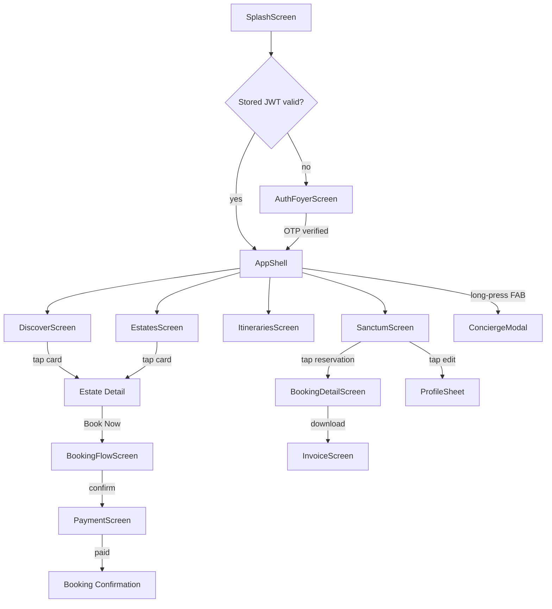
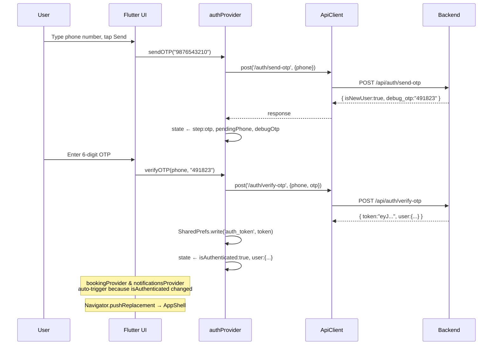
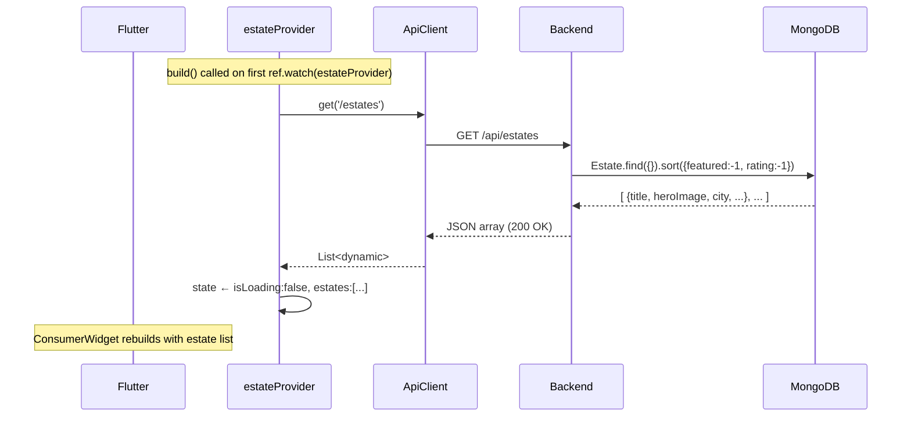
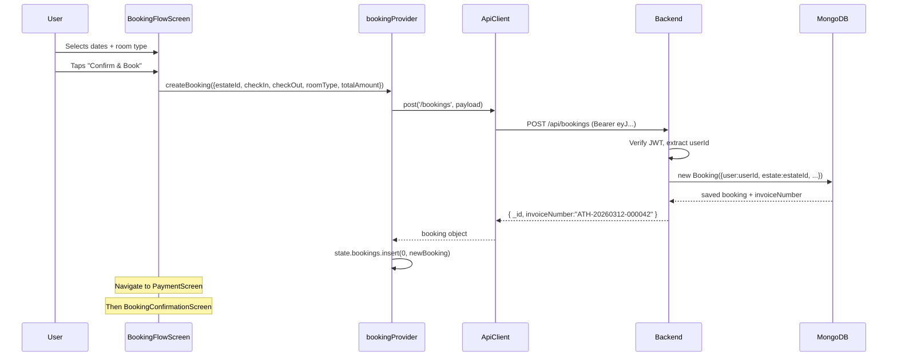

# आतिथ्य — ATITHYA
### Royal Hospitality Platform

> *"आतिथ्य" (Atithya) — the Sanskrit word for hospitality, the art of treating a guest as God.*

A full-stack luxury heritage-hotel booking platform. Curated Indian palaces, fort-stays and riverside haveli properties — bookable through a cinematic Flutter web application backed by a Node.js/MongoDB REST API.

**Live App**: https://jeevan-04.github.io/Atithya
**API Server**: https://atithya-nzqy.onrender.com/api  
**Author**: Jeevan Naidu — [@Jeevan-04](https://github.com/Jeevan-04)

<table>
  <tr>
    <td align="center"><b>Admin</b></td>
    <td align="center"><b>Member</b></td>
    <td align="center"><b>Staff</b></td>
  </tr>
  <tr>
    <td>
      <video src="https://github.com/Jeevan-04/Atithya/blob/main/Admin_Side.mp4" width="180" controls></video>
    </td>
    <td>
      <video src="LINK_TO_VIDEO_2.mp4" width="180" controls></video>
    </td>
    <td>
      <video src="LINK_TO_VIDEO_3.mp4" width="180" controls></video>
    </td>
  </tr>
</table>


---

## Table of Contents

1. [Project Overview](#1-project-overview)
2. [Architecture Diagram](#2-architecture-diagram)
3. [Technology Stack](#3-technology-stack)
4. [Folder Structure](#4-folder-structure)
5. [Backend — Node.js API](#5-backend--nodejs-api)
   - [Server Bootstrap](#51-server-bootstrap)
   - [Database Models](#52-database-models)
   - [API Routes Reference](#53-api-routes-reference)
   - [Authentication Flow](#54-authentication-flow)
   - [Role System](#55-role-system)
6. [Frontend — Flutter Web](#6-frontend--flutter-web)
   - [App Entry Point](#61-app-entry-point)
   - [Theme & Design System](#62-theme--design-system)
   - [State Management (Riverpod)](#63-state-management-riverpod)
   - [Navigation Shell](#64-navigation-shell)
   - [Screen Map](#65-screen-map)
7. [Data Flow Diagrams](#7-data-flow-diagrams)
   - [OTP Auth Flow](#71-otp-auth-flow)
   - [Estate Discovery Flow](#72-estate-discovery-flow)
   - [Booking Flow](#73-booking-flow)
8. [Admin Panel](#8-admin-panel)
9. [Deployment](#9-deployment)
10. [Environment Variables](#10-environment-variables)
11. [Running Locally](#11-running-locally)

---

## 1. Project Overview

Atithya is a **heritage hospitality platform** that puts curated Indian palace-hotels — Taj Mahal Palace, Umaid Bhawan, BrijRama, Fort JadhavGADH — on a single cinematic interface. It is not a booking aggregator. Every property is hand-curated, every story is authored. The design language is dark-luxury: obsidian black, antique gold, ivory text.

**Core user journeys:**

| Journey | Description |
|---------|-------------|
| **Discovery** | Browse cities and featured estates on a magazine-style feed |
| **Estate Detail** | Full-bleed hero, 360° panorama viewer, video tour, room types |
| **Booking** | Multi-step flow: dates → rooms → guest details → payment → confirm |
| **My Dossier** | View past and upcoming reservations, downloadable invoices |
| **Concierge** | AI-powered on-demand assistant (Ollama / smollm2) |
| **Admin Panel** | KPI dashboard, booking management, revenue analytics |

---

## 2. Architecture Diagram

```
┌──────────────────────────────────────────────────────────────────┐
│                          CLIENT LAYER                            │
│                                                                  │
│  Flutter Web App (GitHub Pages)                                  │
│  ┌──────────┐  ┌──────────┐  ┌──────────┐  ┌──────────────┐    │
│  │ Discover │  │ Estates  │  │Itineraries│  │   Sanctum    │    │
│  └────┬─────┘  └────┬─────┘  └────┬─────┘  └──────┬───────┘    │
│       │              │              │                │            │
│  ┌────┴──────────────┴──────────────┴────────────────┴───────┐   │
│  │               Riverpod State Layer (ProviderScope)        │   │
│  │  authProvider  estateProvider  bookingProvider  ...       │   │
│  └───────────────────────────┬───────────────────────────────┘   │
│                              │  HTTP + JWT                        │
└──────────────────────────────┼───────────────────────────────────┘
                               │
                    ┌──────────▼──────────┐
                    │   ApiClient         │
                    │   (singleton)       │
                    │   baseUrl = Render  │
                    └──────────┬──────────┘
                               │  HTTPS REST
┌──────────────────────────────▼───────────────────────────────────┐
│                         SERVER LAYER                             │
│                                                                  │
│  Node.js + Express 5 (Render)                                    │
│  ┌──────────────┐  ┌──────────────┐  ┌──────────────────────┐   │
│  │  /api/auth   │  │ /api/estates │  │   /api/bookings      │   │
│  │  OTP + JWT   │  │  CRUD + filt │  │   create/update/inv  │   │
│  └──────────────┘  └──────────────┘  └──────────────────────┘   │
│  ┌──────────────┐  ┌──────────────┐  ┌──────────────────────┐   │
│  │ /api/admin   │  │ /api/discover│  │   /api/concierge     │   │
│  │  KPIs, stats │  │  city feed   │  │   AI proxy (Ollama)  │   │
│  └──────────────┘  └──────────────┘  └──────────────────────┘   │
│                              │                                   │
└──────────────────────────────┼───────────────────────────────────┘
                               │  Mongoose
                    ┌──────────▼──────────┐
                    │  MongoDB Atlas      │
                    │  ┌─────────────┐    │
                    │  │   estates   │    │
                    │  │   users     │    │
                    │  │   bookings  │    │
                    │  └─────────────┘    │
                    └─────────────────────┘
```



---

## 3. Technology Stack

### Frontend
| Layer | Technology | Version | Purpose |
|-------|-----------|---------|---------|
| Framework | Flutter | 3.x | Cross-platform UI |
| Language | Dart | 3.x | Client logic |
| State | flutter_riverpod | 3.x | Reactive state management |
| HTTP | http | ^1.2 | REST API calls |
| Storage | shared_preferences | ^2.2 | JWT token persistence |
| 3D Viewer | model_viewer_plus | latest | GLB model display |
| Fonts | Google Fonts (Cormorant) | — | Typography |

### Backend
| Layer | Technology | Version | Purpose |
|-------|-----------|---------|---------|
| Runtime | Node.js | 22.x | Server runtime |
| Framework | Express | 5.x | HTTP routing |
| Database | MongoDB Atlas | — | Document store |
| ODM | Mongoose | 9.x | Schema + queries |
| Auth | jsonwebtoken | — | JWT signing/verification |
| AI | node-fetch → Ollama | — | Concierge AI proxy |
| Deployment | Render | — | Hosting (Node.js) |

---

## 4. Folder Structure

```
आतिथ्य/
├── lib/                          ← Flutter source
│   ├── main.dart                 ← App entry point
│   ├── core/
│   │   ├── colors.dart           ← AtithyaColors palette
│   │   ├── theme.dart            ← AtithyaTheme (MaterialTheme)
│   │   ├── typography.dart       ← AtithyaTypography text styles
│   │   ├── widgets.dart          ← Shared UI components
│   │   └── network/
│   │       └── api_client.dart   ← HTTP singleton (ApiClient)
│   ├── providers/
│   │   ├── auth_provider.dart    ← Auth state + OTP flow
│   │   ├── estate_provider.dart  ← Estates list + filters
│   │   ├── booking_provider.dart ← User bookings
│   │   └── notifications_provider.dart ← Notification badges
│   └── features/
│       ├── splash/               ← Animated launch screen
│       ├── auth/                 ← Phone OTP login
│       ├── shell/                ← Bottom-nav host (AppShell)
│       ├── discover/             ← Home feed (cities + estates)
│       ├── estates/              ← Estate list / detail
│       ├── booking/              ← Multi-step booking flow
│       ├── dossier/              ← My reservations
│       ├── payment/              ← Payment screen
│       ├── sanctum/              ← Profile + notifications
│       ├── concierge/            ← AI concierge modal
│       ├── collection/           ← Wishlist / saved
│       ├── itineraries/          ← Trip planner
│       ├── profile/              ← Edit profile sheet
│       └── admin/                ← Admin panel shell + tabs
├── backend/
│   ├── server.js                 ← Express API (all routes, ~1900 lines)
│   ├── seed.js                   ← Initial seed script
│   ├── reset_estates.js          ← Curated estate reset tool
│   ├── package.json
│   └── models/
│       ├── Estate.js             ← Estate Mongoose model
│       ├── User.js               ← User Mongoose model
│       └── Booking.js            ← Booking Mongoose model
├── assets/
│   ├── images/                   ← Static images
│   ├── lottie/                   ← Lottie JSON animations
│   └── videos/                   ← Splash / promo videos
├── pubspec.yaml                  ← Flutter dependencies
└── analysis_options.yaml         ← Dart linter config
```

---

## 5. Backend — Node.js API

### 5.1 Server Bootstrap

`backend/server.js` is a single-file API of ~1900 lines. Startup sequence:

1. Load `.env` via `dotenv`
2. Configure CORS (whitelist: localhost ports + `jeevan-04.github.io`)
3. Connect to MongoDB Atlas via Mongoose
4. Run `_patchBadEstateImages()` — replaces any bad/broken image URLs on every startup
5. Define **all routes inline** (no separate router files)
6. Start listening on `process.env.PORT || 5555`

```js
// Startup sequence (simplified)
require('dotenv').config();
const app = express();
app.use(cors({...}));           // ← explicit origin whitelist
app.use(express.json());        // ← parse JSON bodies

mongoose.connect(process.env.MONGO_URI)
  .then(async () => {
    await _patchBadEstateImages(); // ← self-healing image URLs
  });

// ... ~1900 lines of route definitions ...

app.listen(PORT, () => console.log(`Server on ${PORT}`));
```

**Why one file?** This is a solo portfolio project. Having everything visible in one scroll is faster to debug and demo than maintaining a multi-file router structure.

### 5.2 Database Models

#### User (`models/User.js`)
```
User {
  name: String
  phoneNumber: String (unique, indexed)
  role: enum ['guest','elite','manager','gate_staff','desk_staff','admin','phantom']
  pin: String (hashed, phantom only)
  profileImage: String
  preferences: { categories, facilities, priceRange }
  loyaltyPoints: Number
  notifications: [{ title, body, type, read, createdAt }]
  createdAt, updatedAt
}
```

#### Estate (inline schema in server.js)
```
Estate {
  title, location, city, state, country
  category: String          // "Heritage Palace", "Heritage Fort" etc.
  heroImage: String         // primary full-bleed image URL
  images: [String]          // gallery carousel URLs
  story: String             // editorial narrative (multi-paragraph)
  privileges: [{ label, detail }]   // exclusive guest privileges
  facilities: [String]              // amenities list
  roomTypes: [{ name, price, capacity, desc }]
  basePrice: Number         // lowest room price per night (INR)
  rating: Number            // 0–5
  reviewCount: Number
  coordinates: { lat, lng }
  featured: Boolean
  panoramaImage: String     // equirectangular for 360° viewer
  videoId360: String        // YouTube video ID for tour
  availableRooms: Number
  gateCode, liftFloors, wingCode, wifiPwd, phone
  checkInTime, checkOutTime
}
```

#### Booking (`models/Booking.js`)
```
Booking {
  user: ObjectId → User
  estate: ObjectId → Estate
  checkIn: Date, checkOut: Date
  guests: Number
  roomType: String
  totalAmount: Number
  status: enum ['pending','confirmed','cancelled','refunded']
  paymentMethod: String
  invoiceNumber: String (auto-generated: ATH-YYYYMMDD-XXXXXX)
  cancelledAt: Date
  refundAmount: Number
  notes: String
}
```

### 5.3 API Routes Reference

| Method | Route | Auth | Description |
|--------|-------|------|-------------|
| POST | `/api/auth/send-otp` | — | Send (or generate) OTP for phone number |
| POST | `/api/auth/verify-otp` | — | Validate OTP → return JWT + user |
| POST | `/api/auth/login` | — | Dev bypass: skip OTP, return JWT |
| GET | `/api/auth/me` | ✓ | Return current authenticated user |
| PATCH | `/api/auth/me` | ✓ | Update profile (name, image, preferences) |
| GET | `/api/estates` | — | List estates (query: city, category, maxPrice, facilities, sort) |
| GET | `/api/estates/:id` | — | Full estate detail (all fields) |
| GET | `/api/discover/feed` | — | Featured cities + estates for home screen |
| GET | `/api/bookings` | ✓ | All bookings for the authenticated user |
| POST | `/api/bookings` | ✓ | Create a new booking |
| PATCH | `/api/bookings/:id/cancel` | ✓ | Cancel booking (triggers refund calculation) |
| GET | `/api/bookings/:id/invoice` | ✓ | Returns invoice data for PDF generation |
| GET | `/api/notifications` | ✓ | Unread notifications for user |
| PATCH | `/api/notifications/read-all` | ✓ | Mark all notifications read |
| POST | `/api/concierge/chat` | ✓ | AI chat — proxies to Ollama |
| GET | `/api/admin/system` | admin | KPIs: revenue, bookings, top estates |
| GET | `/api/admin/bookings` | admin | All bookings (paginated) |
| GET | `/api/admin/users` | admin | All users |
| PATCH | `/api/admin/bookings/:id` | admin | Change booking status |
| GET | `/api/trips/routes` | — | Curated multi-city trip routes |

### 5.4 Authentication Flow



**OTP lifecycle:**
- 6-digit random via `crypto.randomInt(100000, 999999)`
- Stored hashed on user doc with `otpExpiry = Date.now() + 10 minutes`
- `debug_otp` returned in response body (no SMS provider — dev/demo mode)
- After verification, OTP fields cleared from document

**JWT payload:**
```json
{ "userId": "...", "role": "elite", "iat": 1700000000, "exp": 1730000000 }
```

### 5.5 Role System

| Role | Description | Capabilities |
|------|-------------|--------------|
| `guest` | Unauthenticated visitor | Browse, search estates only |
| `elite` | Registered member | Book, cancel, invoice, wishlist |
| `manager` | Property manager | View estate-level bookings |
| `gate_staff` | Ground staff | Gate codes, check-in confirmation |
| `desk_staff` | Front desk | Booking management for property |
| `admin` | Full super admin | All dashboard, analytics, management |
| `phantom` | Hidden super-admin | Identical to admin but `role` field shows `desk_staff` |

Middleware chain for protected routes:
```
Request → authenticateToken() → [requireAdmin()] → route handler
```

---

## 6. Frontend — Flutter Web

### 6.1 App Entry Point

**`lib/main.dart`**

```dart
void main() {
  WidgetsFlutterBinding.ensureInitialized();   // (1) Init Flutter engine
  SystemChrome.setSystemUIOverlayStyle(...);   // (2) Transparent status bar
  SystemChrome.setPreferredOrientations(       // (3) Lock to portrait
    [DeviceOrientation.portraitUp]
  ).then((_) {
    runApp(
      const ProviderScope(                     // (4) Riverpod root
        child: AtithyaApp(),
      ),
    );
  });
}
```

1. Must be called before any platform channel usage
2. Dark icons on transparent status bar — full-bleed luxury look
3. Portrait lock ensures consistent layout on all devices
4. `ProviderScope` is the root of the Riverpod DI container

### 6.2 Theme & Design System

#### `lib/core/colors.dart` — AtithyaColors Palette

| Token | Hex | Use |
|-------|-----|-----|
| `obsidian` | `#080A0E` | Primary background |
| `deepMidnight` | `#0D1117` | Secondary background |
| `darkSurface` | `#12161E` | Card surfaces |
| `surfaceElevated` | `#1A1E28` | Elevated glass panels |
| `imperialGold` | `#D4AF6A` | Headings, key accents |
| `burnishedGold` | `#C09040` | Buttons |
| `subtleGold` | `#8F6E30` | Muted accents |
| `shimmerGold` | `#F5DFA0` | Shimmer / highlight |
| `royalMaroon` | `#6B1A2C` | Secondary brand colour |
| `pearl` | `#F7F2E8` | Primary text |
| `cream` | `#EDE5D0` | Secondary text |
| `parchment` | `#D4C9A8` | Captions / tertiary text |
| `ashWhite` | `#8A8078` | Disabled state |
| `success` | `#2E7D5A` | Success states |
| `errorRed` | `#8B1A1A` | Error states |

**Static gradients:**
- `goldGradient` — shimmerGold → imperialGold → burnishedGold (editorial headings)
- `maroonGradient` — royalMaroon → deepMaroon (secondary backgrounds)
- `heroGradient` — semi-transparent scrim over hero images

#### `lib/core/typography.dart` — AtithyaTypography

All type uses **Cormorant Garamond** — an editorial serif that evokes luxury print:
- `displayLarge` — 42sp, 300 weight (palace names)
- `displayMedium` — 28sp, 400 weight (section heads)
- `bodyLarge` — 16sp, 400 weight (body text)
- `bodyElegant` — 15sp, 300 weight, 1.6 line height (editorial narrative)
- `labelSmall` — 11sp, 500 weight, letter-spaced (tags, labels)

#### `lib/core/theme.dart` — AtithyaTheme

```dart
ThemeData.dark() with:
  useMaterial3: true
  scaffoldBackgroundColor: obsidian
  colorScheme: gold/maroon/pearl
  SnackBarTheme: gold border + elevated surface
  pageTransitionsTheme: Cupertino on all platforms
```

### 6.3 State Management — Riverpod

The app uses **flutter_riverpod 3.x** with the modern `Notifier` / `NotifierProvider` pattern (not legacy `StateNotifier`).



**Pattern anatomy:**

```dart
// 1. State object (immutable)
class EstateState {
  final bool isLoading;
  final List<dynamic> estates;
  final String? error;
  EstateState copyWith({...}) => EstateState(...);
}

// 2. Notifier (logic + state mutations)
class EstateNotifier extends Notifier<EstateState> {
  @override
  EstateState build() {                    // ← runs once, on first watch
    Future.microtask(() => fetchEstates()); // ← defer so build() returns fast
    return EstateState(isLoading: true);
  }

  Future<void> fetchEstates() async {
    state = state.copyWith(isLoading: true);
    final data = await apiClient.get('/estates');
    state = state.copyWith(isLoading: false, estates: data);
  }
}

// 3. Provider (global registry)
final estateProvider = NotifierProvider<EstateNotifier, EstateState>(
  EstateNotifier.new
);

// 4. Widget reads it
class EstatesScreen extends ConsumerWidget {
  @override
  Widget build(BuildContext context, WidgetRef ref) {
    final estateState = ref.watch(estateProvider);
    if (estateState.isLoading) return LoadingWidget();
    return EstateGrid(estates: estateState.estates);
  }
}
```

**Auth-gating pattern:**

bookingProvider and notificationsProvider only begin fetching after the user is authenticated. They watch `authProvider.select((s) => s.isAuthenticated)` — if the user logs out, they instantly return to empty state:

```dart
@override
BookingState build() {
  final isAuth = ref.watch(authProvider.select((s) => s.isAuthenticated));
  if (!isAuth) return BookingState();           // ← guest: empty, no API call
  Future.microtask(() => fetchMyBookings());    // ← authenticated: fetch
  return BookingState(isLoading: true);
}
```

### 6.4 Navigation Shell

**`lib/features/shell/app_shell.dart`** — `AppShell`

4-tab floating bottom navigation with animated gold pill indicator.

| Index | Icon | Screen |
|-------|------|--------|
| 0 | `explore` | DiscoverScreen |
| 1 | `domain` | EstatesScreen |
| 2 | `card_travel` | ItinerariesScreen |
| 3 | `account_circle` | SanctumScreen |

**Key implementation details:**

- `IndexedStack` keeps all 4 screens alive simultaneously — no scroll position loss on tab switch
- `AnimationController` + `CurvedAnimation(Curves.easeOutQuart)` animates the gold pill between tabs
- `shellTabProvider` allows any screen to programmatically switch tabs (e.g., a booking confirmation can jump to "Dossier")
- Long-press the central circle → `ConciergeModal` (AI chat)
- `extendBody: true` on `Scaffold` so screen content renders behind the nav bar

### 6.5 Screen Map



---

## 7. Data Flow Diagrams

### 7.1 OTP Auth Flow



### 7.2 Estate Discovery Flow



### 7.3 Booking Flow



---

## 8. Admin Panel

The admin panel (`lib/features/admin/admin_shell.dart`) is a separate shell accessible only when `role ∈ {admin, phantom}`.

```
AdminShell
├── Dashboard Tab
│   ├── KPI Grid (Revenue, Bookings, Members, Occupancy)
│   ├── Revenue Breakdown (Booking / Food / Refunds / Cancel Fee)
│   └── Top Estates This Month
├── Bookings Tab
│   └── Paginated list with status filter chips
├── Estates Tab
│   └── Estate cards with edit capability
└── Users Tab
    └── Member list with role badges
```

**KPI source** — `GET /api/admin/system` returns:

```json
{
  "revenue": 4250000,
  "cancelledRevenue": 320000,
  "refundedAmount": 256000,
  "topEstatesMonth": [
    { "title": "Taj Mahal Palace", "city": "Mumbai", "count": 12, "revenue": 1020000 }
  ],
  "monthlyRevenue": [125000, 180000, 210000, 155000, 195000, 230000]
}
```

**Logout** — `_LogoutButton` calls `authProvider.notifier.logout()` then `Navigator.pushAndRemoveUntil(AuthFoyerScreen, (_) => false)` — full navigation stack reset, preventing back-navigation to admin.

---

## 9. Deployment

### Frontend → GitHub Pages

```bash
flutter build web --no-tree-shake-icons
# Commit build/web → gh-pages branch
```

### Backend → Render

| Setting | Value |
|---------|-------|
| Service Type | Node.js |
| Build Command | `npm install` |
| Start Command | `node server.js` |
| Node Version | 22.x |
| Auto-deploy | On push to `main` |

> **Express 5 gotcha**: `path-to-regexp` v8 does not accept `*` as a wildcard in `app.options('*', ...)`. Remove the line entirely — `cors()` middleware handles OPTIONS preflight automatically.

---

## 10. Environment Variables

```env
# backend/.env
MONGO_URI=mongodb+srv://<user>:<pass>@cluster.mongodb.net/atithya
JWT_SECRET=your_long_random_secret_key_here
PORT=5555
OLLAMA_URL=http://127.0.0.1:11434
AI_MODEL=smollm2:1.7b
```

---

## 11. Running Locally

```bash
# Backend
cd backend && npm install
node server.js                  # http://localhost:5555

# Seed with curated estate data
node reset_estates.js

# Flutter frontend
flutter pub get
flutter run -d chrome --web-port=8080   # http://localhost:8080
```

---

## Design Decisions

| Decision | Rationale |
|----------|-----------|
| Single `server.js` | Solo project — faster to debug, all routes in one scroll |
| `IndexedStack` navigation | Preserves scroll position on tab switch; no stutter |
| Auth-gated providers | Notifications + bookings only fetch when authenticated |
| `_patchBadEstateImages()` | Self-healing: bad URLs replaced on every deploy automatically |
| `copyWith` pattern | Immutable state; every mutation is a new object; predictable re-render |
| `phantom` role | Admin disguised as `desk_staff` — security through obscurity |
| Dark-luxury palette | Obsidian + gold evokes heritage Indian hospitality branding |
| Cormorant Garamond | Serif editorial font — luxury print magazine aesthetic |

---

*© 2025–2026 Jeevan Naidu. All rights reserved.*
